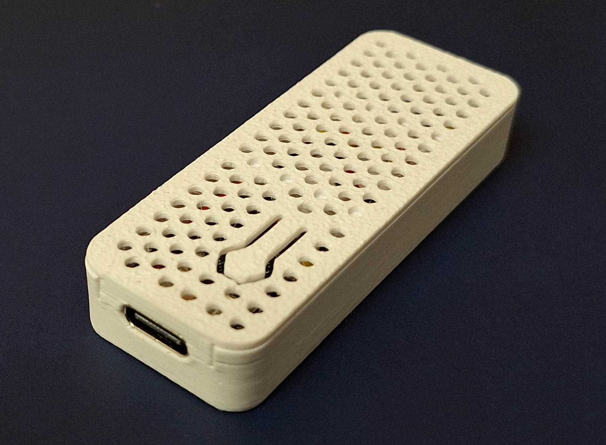
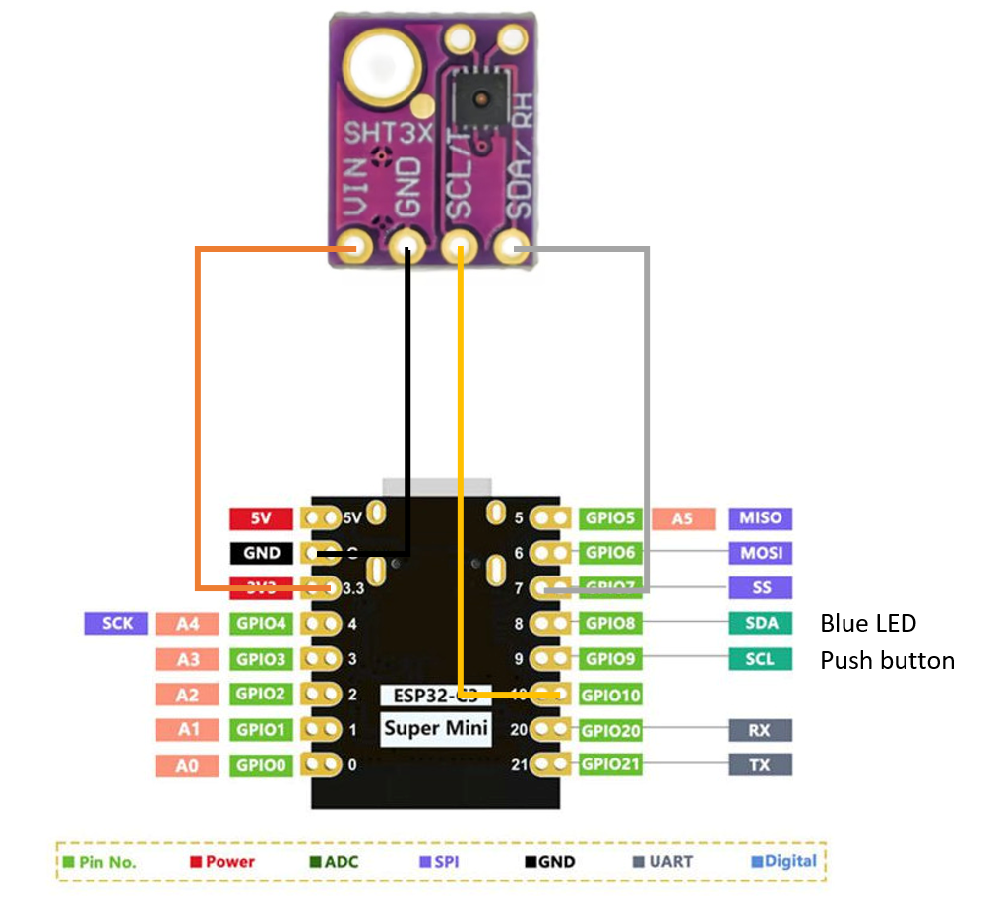
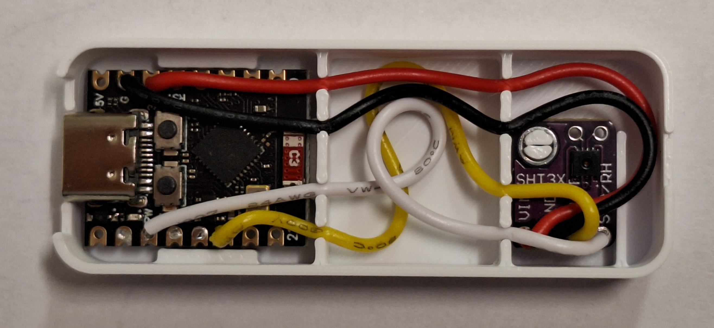
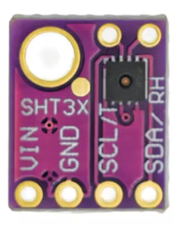

# Tasmota Temperature / Humidity Sensor mTH-1
This device is a USB powered, Tasmota driven temperature / humidity sensor, based on the SHT30 chip. The total cost is about 5$.

 

## Schematic

 

## Assembly

 

## Material list
- 1 x Esp32-C3 Super Mini
- 1 x SHT30 Temperatuere / humidity sensor module
- 4 x Cable ca. 8cm long
- 1 x case (see stl files)

Available on AliExpress.

 
 

## Flashing the ESP32 with Tasmota

- Connect your sensor to a computer using a USB cable. 
-	Open a browser, and go to the page https://tasmota.github.io/install/.
-	Select the Tasmota version you want to install and click the blue *Connect* button to connect your sensor to the installation app.
-	Select the serial port and click *Connect*.
-	Click on *Install Tasmota*, check the *Erase device* checkbox, and click *Next*.
-	Read the warning, then click *Install*.

This will install Tasmota on your ESP32 module.
 
 

## Connecting to Tasmota

- You need a computer with Wi-Fi.
-	Your sensor is currently an Access Point, and you can find it in the list of available Wi-Fi networks. The SSID is "tasmota-" followed by some numbers and letters.
-	Connect to this Wi-Fi network.
-	Open a browser and go to the URL: http://192.168.4.1
-	Now you can connect your sensor to your own Wi-Fi network by entering your SSID and Wi-Fi password.
-	Click on Save and wait a moment.
-	Tasmota will now automatically obtain an IP address from your network.
-	If you have only one Wi-Fi network and your computer automatically reconnects to it, Tasmota will display the assigned IP address. 
-	Click on the link, and your browser will automatically open the configuration page of your sensor.
-	If your computer does not automatically reconnect to your Wi-Fi network or connects to a different one, Tasmota won't be able to show you its IP address, and you will have to find it in your Wi-Fi router.

### Optional (but recommended)
-	You can now assign a fixed IP address to your sensor.
-	In the Tasmota menu, select Tools and then Console.
-	In the text field, enter: IPAddress1 <your desired fixed IP address> and confirm by pressing Enter.
-	In the text field, enter: Restart 1 and confirm by pressing Enter to restart the sensor. After the restart, the new IP address will be active.
-	Now you must enter your new fixed IP address into your browser to regain access to the Tasmota menu.
 

## Configure the Sensor
-	Make sure the sensor is reachable via the entered IP address.
-	Open the file config.html in a browser.
-	Enter your sensor's IP address and click Set configuration.
The configuration script assigns a user-friendly name to the device, configures the ESP32 processor's GPIOs for the temperature sensor, and installs a script for power-saving mode.
 

## Usage
### Power-Saving Mode
When the mTH-1 starts up, the blue LED will blink for about 10 seconds. During this time, you can press the push button to prevent the processor from entering power-saving mode.
If the button is not pressed, the processor will enter power-saving mode for two minutes, then wake up, send its data, and return to power-saving mode.

In power-saving mode, the processor is not reachable over the network.

### Force Access Point Mode
If the processor is not in power-saving mode and the push button is pressed for more than four seconds, the mTH-1 will switch to Access Point mode for three minutes.
This allows you to reconnect the sensor to a different network if, for example, it becomes unreachable after moving to a new location.

### MQTT
Since the processor is not reachable over the network most of the time, it is recommended to enable MQTT. This allows the sensor to automatically send its data to the MQTT server each time it wakes up.

### Why use power-saving mode even when operating via USB?
During continuous operation, the temperature sensor heats up slightly and always reports a slightly higher temperature because it also measures its own heat output. This does not happen in power-saving mode.
